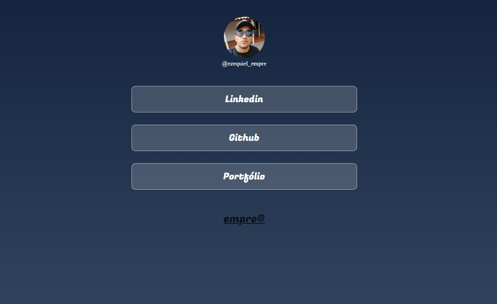

 
  
<h2>Resumo</h2>

	&#128512; Empre é uma marca criada por mim (@ezequiel_empre), com o objetivo de manifestar minha paixão pela tecnologia, pelo a inovação, pelo novo e pela organização.

&#128187;Apaixonado em computadores, essa marca é também para  divulgar serviços de informática, realizar e ajudar pessoas a resolverem problemas relacionados a área. 

-------------------------------------------

&#128640;Esse projeto é para facilitar o contado e divulgação dos meus trabalhos, ele ficará na bio do instagram

Projeto inicial 
